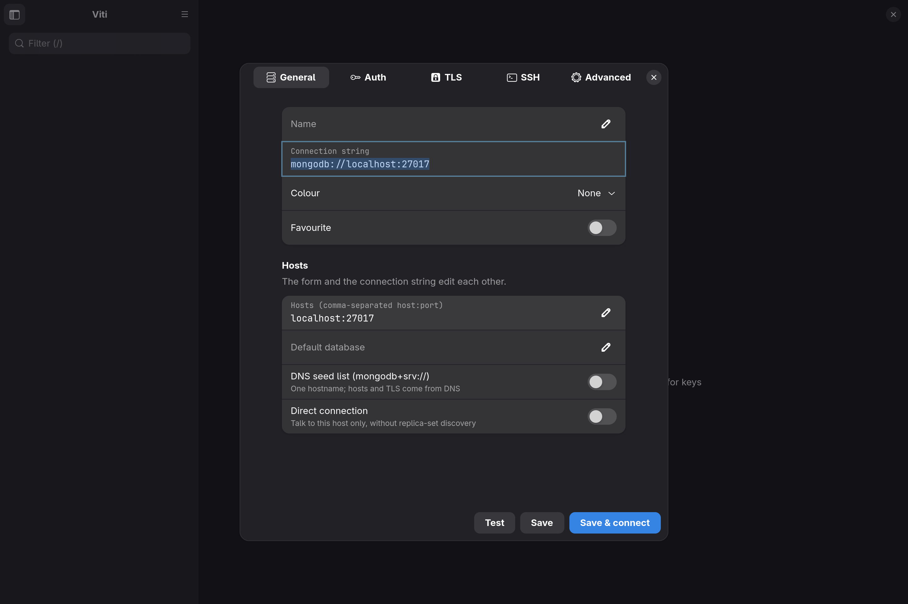

# Viti

Viti is a native GTK MongoDB client for Linux, built in Rust. It combines the
workflows of MongoDB Compass with a fast, keyboard-first interface.



> Viti is under active development. Review destructive operations carefully
> and keep backups of important data.

## Highlights

- Browse, filter, edit, import, and export documents.
- Build aggregation pipelines with live previews.
- Inspect schemas, indexes, validation rules, explain plans, and server
  performance.
- Work in list, JSON, and table views with pagination for large collections.
- Edit with the built-in editor or your preferred terminal editor.
- Use vi-style navigation, configurable shortcuts, and a `:` command palette.
- Connect with TLS, SSH tunnels, authentication mechanisms, and imported
  MongoDB Compass profiles.
- Optionally draft queries and pipelines through local `claude` or `codex`
  commands.

## Build and install

Viti requires Rust and these Linux libraries:

- GTK 4.18 or newer
- libadwaita 1.7 or newer
- GtkSourceView 5
- VTE for GTK 4

Run it from the source tree:

```sh
cargo run
```

Or install the binary, desktop entry, and icons for the current user:

```sh
./install.sh
```

The installer writes to `~/.local` and does not require root access.

## Usage

Start Viti and add a connection with `Ctrl+O`:

```sh
viti
```

For local development, a URI can be supplied directly:

```sh
viti mongodb://localhost:27017
```

Avoid putting passwords in command-line URIs because shell history and process
lists may expose them. Viti stores connection profiles without passwords and
uses the system keyring by default for secrets.

Useful shortcuts:

| Key | Action |
| --- | --- |
| `Ctrl+O` | Connections |
| `/` | Filter or focus the query bar |
| `:` | Command palette |
| `e` / `E` | Edit inline / with the configured editor |
| `v` | Cycle document views |
| `?` | Show all shortcuts |

## Development

```sh
cargo fmt -- --check
cargo clippy --all-targets -- -D warnings
cargo test
```

Tests that require a live MongoDB instance are skipped unless `VITI_TEST_URI`
is set.
